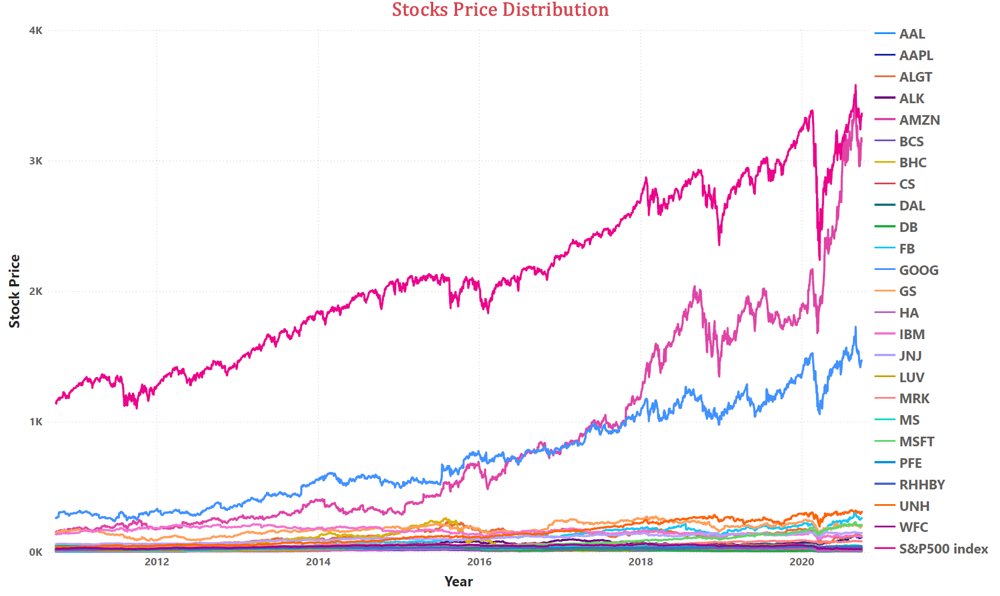
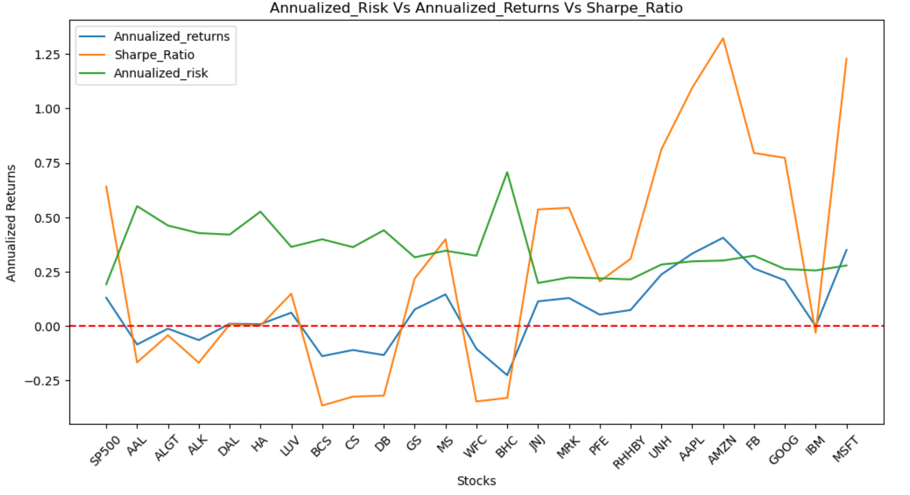
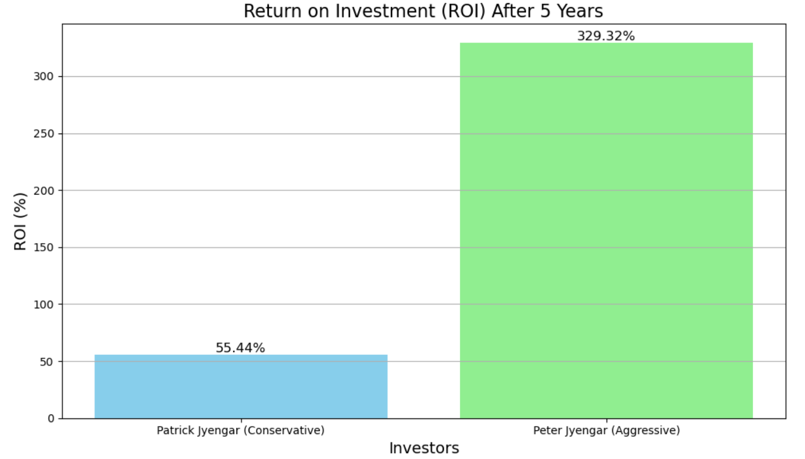
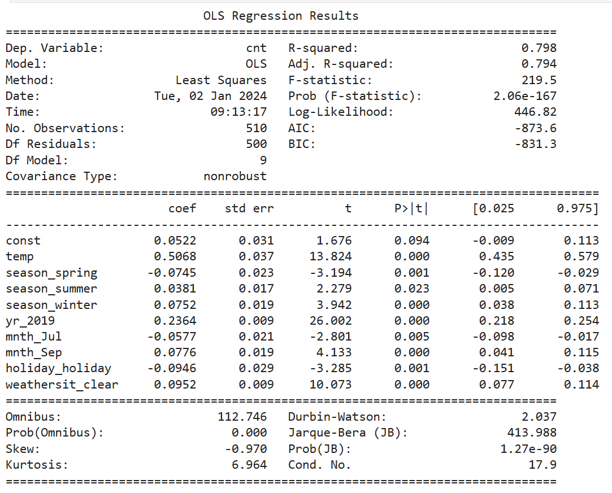
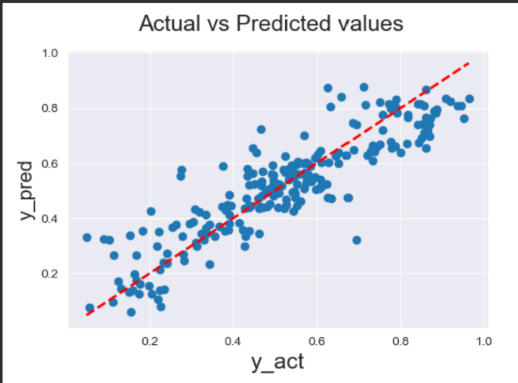
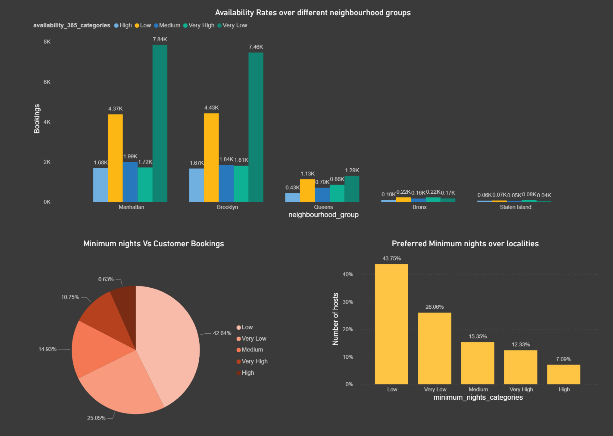
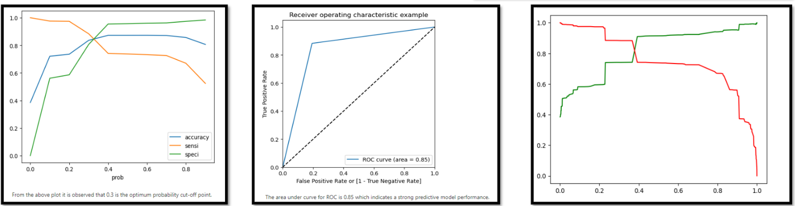
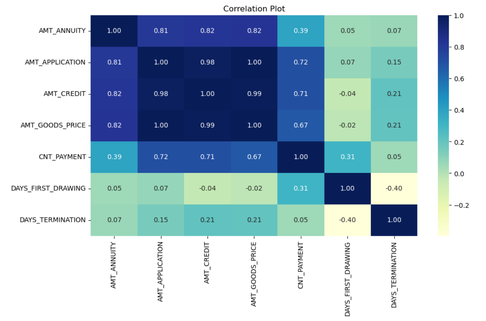
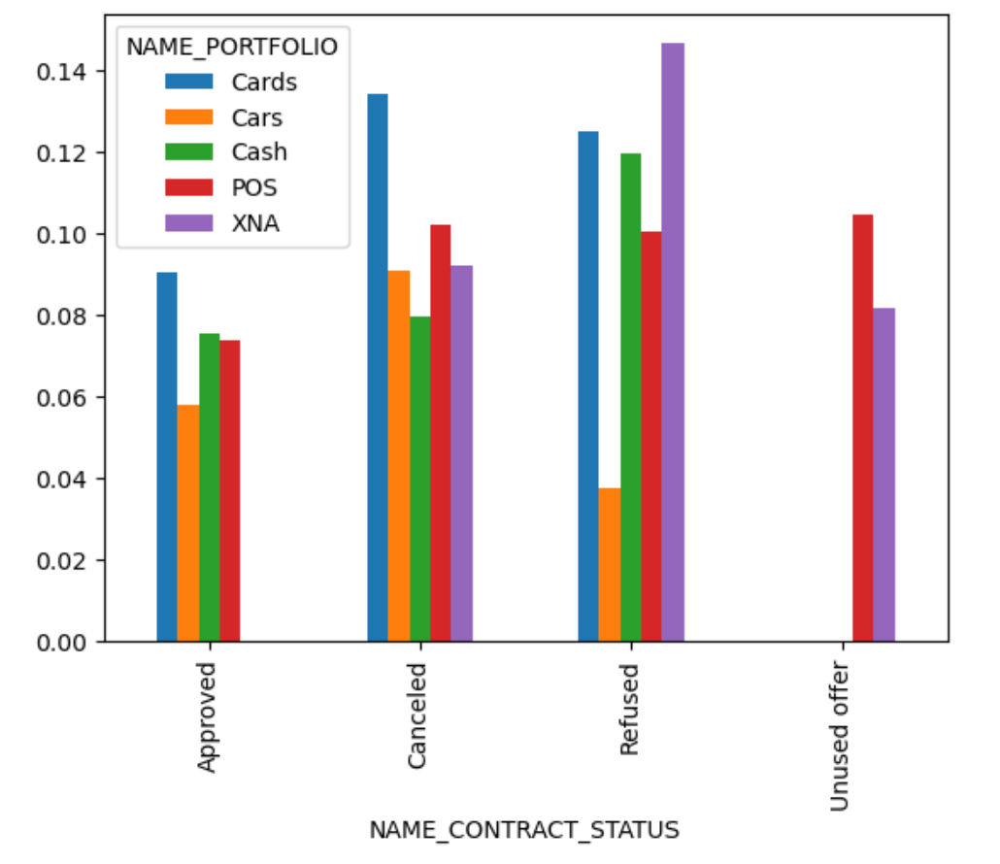

# Portfolio
---
## Projects in data science, machine learning and PowerBI
---
### [STOCK MARKET PORTFOLIO ANALYSIS](https://github.com/HarshavardhiniJS/Stock-Market-Portfolio-Analysis/)
Recommended stocks for the investor’s portfolio based on risk adjusted returns. Predicted the growth of the portfolio for next 5 years based on technical analysis of stocks.
Analyzed 20 stocks in various sectors for a period of 10 years with S&P500 index returns thereby creating a Power BI dashboard visualization.

[View Code in GitHub](https://github.com/HarshavardhiniJS/Stock-Market-Portfolio-Analysis/)

     
---

### [MACHINE LEARNING REGRESSION MODEL - TO PREDICT THE DEMAND FOR BIKES BASED ON ENVIRONMENTAL AND SEASONAL SETTINGS](https://github.com/HarshavardhiniJS/ML-regression)
Conducted Exploratory Data Analysis to uncover bike usage trends and patterns. Developed a Multiple Linear Regression model to identify the demand dynamics of a new market. Developed a Multiple Linear Regression model using Random Forest Regression

[View Code in GitHub](https://github.com/HarshavardhiniJS/ML-regression)

     
---
### [POWER BI - AIR BNB CASE STUDY](https://github.com/HarshavardhiniJS/PowerBI-Airbnb/blob/main/Airbnb_powerbi_export.pdf)
Analyzed post-pandemic Airbnb user trends, uncovering critical insights that led to a 25% increase in booking rates and a 30% boost in customer satisfaction. Through the creation of dynamic dashboards, I empowered the business with faster, data-driven insights that significantly enhanced decision-making.

[View in GitHub](https://github.com/HarshavardhiniJS/PowerBI-Airbnb)

---
### [LEAD SCORE CASE STUDY-LOGISTIC REGRESSION ANALYSIS](https://github.com/HarshavardhiniJS/Lead-scoring-case-study/blob/main/Presentation.pdf)
Conducted a detailed Exploratory Data Analysis (EDA), uncovering key patterns that highlighted the top 20% of leads most likely to convert for an education company. Developed a Logistic Regression model that accurately assigned lead scores, improving lead prioritization and resulting in a 30% increase in lead conversion rates. Evaluated model performance with a Precision of 85% and a Recall of 80%, optimizing for Sensitivity and Specificity, which improved targeting efficiency by 25%

[View Code in GitHub](https://github.com/HarshavardhiniJS/Lead-scoring-case-study)

       
---

### [EXPLORATORY DATA ANALYSIS (EDA) - RISK ANALYSIS FOR BANK LOAN](https://github.com/HarshavardhiniJS/EDA-Risk_Analysis)
Conducted comprehensive EDA to evaluate loan authorization risks for banks. Analyzed datasets of loan defaulters and current applicants, identifying critical risk factors. Enhanced risk prediction accuracy also by reducing potential defaults by 30%. The analysis provided a streamlined loan approval processes, additionally, boosting efficiency by 25%. 

[View Code in GitHub](https://github.com/HarshavardhiniJS/EDA-Risk_Analysis)

      
---

### [RSVP MOVIES - SQL CASE STUDY](https://github.com/HarshavardhiniJS/RSVP-Movie-SQL-casestudy)
Conducted in-depth SQL analysis for RSVP Movies, uncovering key trends and delivering actionable insights. Enhanced strategic decision-making and optimized movie-related strategies.

[View Code in GitHub](https://github.com/HarshavardhiniJS/RSVP-Movie-SQL-casestudy)

  
---
## Publications

STUDY OF BIOMETRICAL CHARACTERS ON RICE USING MULTIPLE LINEAR REGRESSION MODELS IN THE INTERNATIONAL JOURNAL OF CURRENT MICROBIOLOGY AND APPLIED SCIENCE, January 2021, Harshavardhini, J. S., R. Vasanthi, N. Thavaprakaash, Kalpana, M., Int.J.Curr.Microbiol.App.Sci., 10(1), 2910-2915, [https://doi.org/10.20546/ijcmas.2021.1001.337](https://doi.org/10.20546/ijcmas.2021.1001.337)

