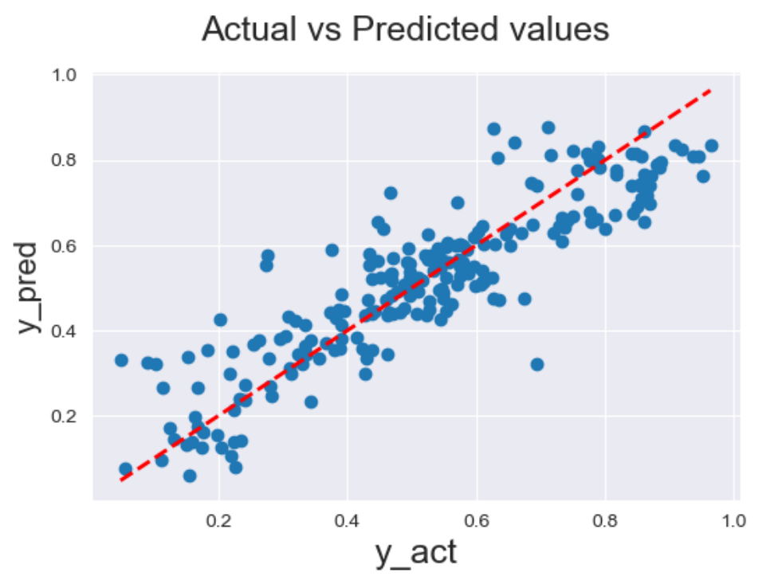

# Portfolio

## Projects in data science, machine learning and PowerBI
---

### [MACHINE LEARNING REGRESSION MODEL - TO PREDICT THE DEMAND FOR BIKES BASED ON ENVIRONMENTAL AND SEASONAL SETTINGS] (https://github.com/HarshavardhiniJS/ML-regression)
Conducted Exploratory Data Analysis to uncover bike usage trends and patterns. Developed a Multiple Linear Regression model to identify the demand dynamics of a new market. Developed a Multiple Linear Regression model using Random Forest Regression

[View Code in GitHub](https://github.com/HarshavardhiniJS/ML-regression)

     
---
### [POWER BI - AIR BNB CASE STUDY] (https://github.com/HarshavardhiniJS/PowerBI-Airbnb/blob/main/Airbnb_powerbi_export.pdf)
Analyzed post-pandemic Airbnb user trends, uncovering critical insights that led to a 25% increase in booking rates and a 30% boost in customer satisfaction. Through the creation of dynamic dashboards, I empowered the business with faster, data-driven insights that significantly enhanced decision-making.

[View in GitHub](https://github.com/HarshavardhiniJS/PowerBI-Airbnb)

---
[Project 3 Title](http://example.com/)

---

### Category Name 2

- [Project 1 Title](http://example.com/)
- [Project 2 Title](http://example.com/)
- [Project 3 Title](http://example.com/)
- [Project 4 Title](http://example.com/)
- [Project 5 Title](http://example.com/)

---

---

Page template forked from <a href="https://github.com/evanca/quick-portfolio">evanca</a>

<!-- Remove above link if you don't want to attibute -->
